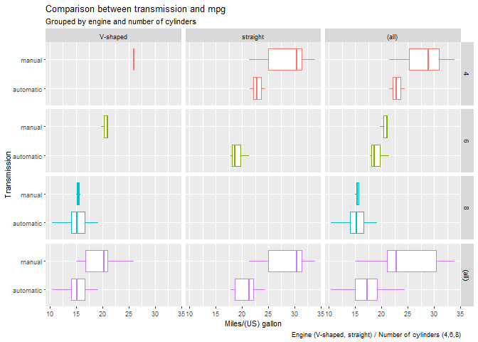
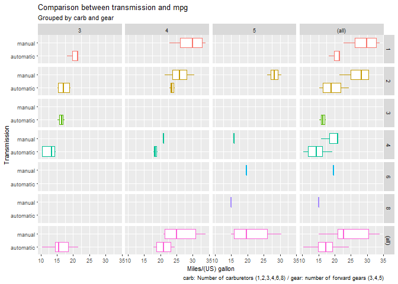
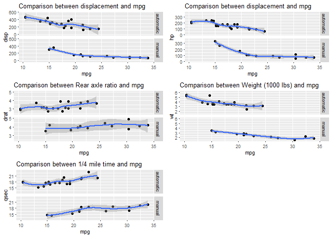
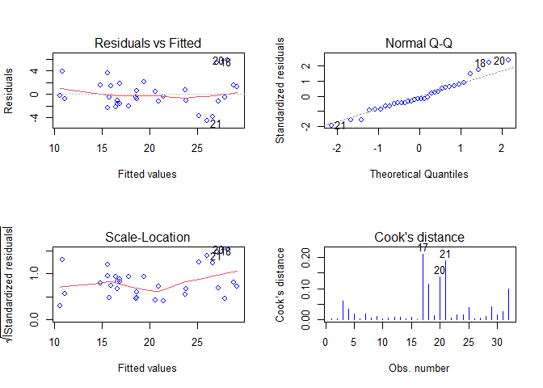
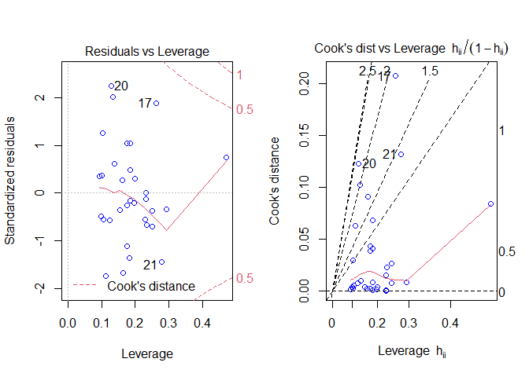

[Github link](https://github.com/darwinnava/Regression_Models_Project)


## Data processing

This project involves exploring the mtcars data available at The R Datasets Package, "Motor Trend Car Road Tests" extracted from the 1974 Motor Trend US magazine. It should be studied fuel economy (the relationship between the distance traveled and fuel consumed) across different car's transmission type. Other aspects of automobile design and performance for 32 automobiles (1973–74 models) are available.

### An exploratory statistical analysis. Summary of the data.
**Loading the R object college and displaying the internal structure.** 
This will allow establishing a strategy for answering the study question: Manual vs automatic car transmission. Which one has better fuel economy?

```
## 'data.frame':	32 obs. of  11 variables:
##  $ mpg : num  21 21 22.8 21.4 18.7 18.1 14.3 24.4 22.8 19.2 ...
##  $ cyl : num  6 6 4 6 8 6 8 4 4 6 ...
##  $ disp: num  160 160 108 258 360 ...
##  $ hp  : num  110 110 93 110 175 105 245 62 95 123 ...
##  $ drat: num  3.9 3.9 3.85 3.08 3.15 2.76 3.21 3.69 3.92 3.92 ...
##  $ wt  : num  2.62 2.88 2.32 3.21 3.44 ...
##  $ qsec: num  16.5 17 18.6 19.4 17 ...
##  $ vs  : num  0 0 1 1 0 1 0 1 1 1 ...
##  $ am  : num  1 1 1 0 0 0 0 0 0 0 ...
##  $ gear: num  4 4 4 3 3 3 3 4 4 4 ...
##  $ carb: num  4 4 1 1 2 1 4 2 2 4 ...
```
**Description of variables available in Appendix - Code**

**Graphs: let's see some aspects of automobile design and performance**
<!-- --><!-- -->

```
## `geom_smooth()` using method = 'loess' and formula 'y ~ x'
## `geom_smooth()` using method = 'loess' and formula 'y ~ x'
## `geom_smooth()` using method = 'loess' and formula 'y ~ x'
## `geom_smooth()` using method = 'loess' and formula 'y ~ x'
## `geom_smooth()` using method = 'loess' and formula 'y ~ x'
```

<!-- -->

**Observations:** Grouping by engine, number of cylinders, number of forward gears, and number of carburetors, manual transmission shows better fuel efficiency (mpg) than the automatic one. Continuous variables vs mpg plots show similar trends for both types of transmissions (for example: the lower the weight, the higher the mpg or the higher the Rear axle ratio, the lower the mpg, for both transmissions).

Studying the estimation precision of a study is  important. Similarly, the results relevance. Once a sample variable value has been calculated, it is required to approximate the range of values where lies the inaccessible real value of that population variable. Therefore, different statistical inference methods should be applied.
  
**Mean of continuous variables by transmission type and T.test for wt and mpg:**
Assumptions: independent samples and randomly selected from the population. Outliers were not observed. Unequal variances. 95% confidence level. Ha: mpg|automatic < mpg|manual and Ha: wt|automatic > wt|manual

```
## # A tibble: 2 x 7
##   am        mpg_mean wt_mean disp_mean hp_mean drat_mean qsec_mean
##   <fct>        <dbl>   <dbl>     <dbl>   <dbl>     <dbl>     <dbl>
## 1 automatic     17.1    3.77      290.    160.      3.29      18.2
## 2 manual        24.4    2.41      144.    127.      4.05      17.4
```

```
## 
## 	Welch Two Sample t-test
## 
## data:  by_am_vs_cyl_gear_carb$mpg[by_am_vs_cyl_gear_carb$am == "automatic"] and by_am_vs_cyl_gear_carb$mpg[by_am_vs_cyl_gear_carb$am == "manual"]
## t = -3.7671, df = 18.332, p-value = 0.0006868
## alternative hypothesis: true difference in means is less than 0
## 95 percent confidence interval:
##       -Inf -3.913256
## sample estimates:
## mean of x mean of y 
##  17.14737  24.39231
```

```
## 
## 	Welch Two Sample t-test
## 
## data:  by_am_vs_cyl_gear_carb$wt[by_am_vs_cyl_gear_carb$am == "automatic"] and by_am_vs_cyl_gear_carb$wt[by_am_vs_cyl_gear_carb$am == "manual"]
## t = 5.4939, df = 29.234, p-value = 3.136e-06
## alternative hypothesis: true difference in means is greater than 0
## 95 percent confidence interval:
##  0.9380426       Inf
## sample estimates:
## mean of x mean of y 
##  3.768895  2.411000
```
  
**Observations: 1. mpg|automatic < mpg|manual, Ho: rejected. 2. wt|automatic > wt|manual, Ho: rejected.
  
### An Inferential Data Analysis of the "mtcars" data
The most common methodologies in inferential statistics are confidence intervals, hypothesis tests, and regression analysis. The third one should be used in this activity. It is required to find a parsimonious, easily described mean relationship between transmission and mpg (Modeling).

**Adjusted models**

```r
fit1 <- lm(mpg ~ am, data=by_am_vs_cyl_gear_carb)
fit2 <- lm(mpg ~ am + wt, data=by_am_vs_cyl_gear_carb)
fit3 <- lm(mpg ~ am + wt + disp , data=by_am_vs_cyl_gear_carb)
fit4 <- lm(mpg ~ am + wt + cyl , data=by_am_vs_cyl_gear_carb)
fit5 <- lm(mpg ~ am + wt + disp + cyl , data=by_am_vs_cyl_gear_carb)
fit6 <- lm(mpg ~ am + wt + cyl + carb, data=by_am_vs_cyl_gear_carb)
fit7 <- lm(mpg ~ am + wt + cyl + gear, data=by_am_vs_cyl_gear_carb)
fit8 <- lm(mpg ~ am + wt + cyl + hp, data=by_am_vs_cyl_gear_carb)
fit9 <- lm(mpg ~ am + wt + cyl + vs, data=by_am_vs_cyl_gear_carb)
fit10 <- lm(mpg ~ am + wt + cyl + drat, data=by_am_vs_cyl_gear_carb)
fit11 <- lm(mpg ~ am + wt + cyl + qsec, data=by_am_vs_cyl_gear_carb)
fit12 <- lm(mpg ~ ., data=by_am_vs_cyl_gear_carb)
```

```
## Analysis of Variance Table
## 
## Model 1: mpg ~ am
## Model 2: mpg ~ am + wt
##   Res.Df    RSS Df Sum of Sq      F    Pr(>F)    
## 1     30 720.90                                  
## 2     29 278.32  1    442.58 46.115 1.867e-07 ***
## ---
## Signif. codes:  0 '***' 0.001 '**' 0.01 '*' 0.05 '.' 0.1 ' ' 1
```

```
## Analysis of Variance Table
## 
## Model 1: mpg ~ am + wt
## Model 2: mpg ~ am + wt + disp
##   Res.Df    RSS Df Sum of Sq      F  Pr(>F)  
## 1     29 278.32                              
## 2     28 246.56  1    31.763 3.6072 0.06788 .
## ---
## Signif. codes:  0 '***' 0.001 '**' 0.01 '*' 0.05 '.' 0.1 ' ' 1
```

```
## Analysis of Variance Table
## 
## Model 1: mpg ~ am + wt
## Model 2: mpg ~ am + wt + cyl
##   Res.Df    RSS Df Sum of Sq      F   Pr(>F)   
## 1     29 278.32                                
## 2     27 182.97  2    95.351 7.0353 0.003473 **
## ---
## Signif. codes:  0 '***' 0.001 '**' 0.01 '*' 0.05 '.' 0.1 ' ' 1
```

```
## Analysis of Variance Table
## 
## Model 1: mpg ~ am + wt + cyl
## Model 2: mpg ~ am + wt + disp + cyl
##   Res.Df    RSS Df Sum of Sq      F Pr(>F)
## 1     27 182.97                           
## 2     26 182.87  1  0.099003 0.0141 0.9065
```

```
## Analysis of Variance Table
## 
## Model 1: mpg ~ am + wt + cyl
## Model 2: mpg ~ am + wt + cyl + carb
##   Res.Df    RSS Df Sum of Sq      F Pr(>F)
## 1     27 182.97                           
## 2     22 163.89  5    19.078 0.5122 0.7641
```

```
## Analysis of Variance Table
## 
## Model 1: mpg ~ am + wt + cyl
## Model 2: mpg ~ am + wt + cyl + gear
##   Res.Df    RSS Df Sum of Sq      F Pr(>F)
## 1     27 182.97                           
## 2     25 174.78  2    8.1849 0.5854 0.5644
```

```
## Analysis of Variance Table
## 
## Model 1: mpg ~ am + wt + cyl
## Model 2: mpg ~ am + wt + cyl + hp
##   Res.Df    RSS Df Sum of Sq      F  Pr(>F)  
## 1     27 182.97                              
## 2     26 151.03  1    31.943 5.4991 0.02693 *
## ---
## Signif. codes:  0 '***' 0.001 '**' 0.01 '*' 0.05 '.' 0.1 ' ' 1
```

```
## Analysis of Variance Table
## 
## Model 1: mpg ~ am + wt + cyl + hp
## Model 2: mpg ~ am + wt + cyl + vs
##   Res.Df    RSS Df Sum of Sq F Pr(>F)
## 1     26 151.03                      
## 2     26 180.02  0   -28.998
```

```
## Analysis of Variance Table
## 
## Model 1: mpg ~ am + wt + cyl + hp
## Model 2: mpg ~ am + wt + cyl + drat
##   Res.Df    RSS Df Sum of Sq F Pr(>F)
## 1     26 151.03                      
## 2     26 182.75  0   -31.724
```

```
## Analysis of Variance Table
## 
## Model 1: mpg ~ am + wt + cyl + hp
## Model 2: mpg ~ am + wt + cyl + qsec
##   Res.Df    RSS Df Sum of Sq F Pr(>F)
## 1     26 151.03                      
## 2     26 159.42  0   -8.3988
```

```
## Analysis of Variance Table
## 
## Model 1: mpg ~ am + wt + cyl + hp
## Model 2: mpg ~ cyl + disp + hp + drat + wt + qsec + vs + am + gear + carb
##   Res.Df    RSS Df Sum of Sq      F Pr(>F)
## 1     26 151.03                           
## 2     15 120.40 11    30.623 0.3468 0.9588
```
  
**Observations:** Some significant improvements in  some model comparisons. Fit4 and Fit8 show better performance (VIFs should be evaluated). Note: if the resulting p-value is sufficiently low (usually less than 0.05), we conclude that the more complex model is significantly better than the simpler model, and thus favor the more complex model. If the p-value is not sufficiently low (usually greater than 0.05), we should favor the simpler model. 

**Variance inflation factor, VIF for fit4 and fit 8**

```
## [1] "VIF - FIT4"
```

```
##         GVIF Df GVIF^(1/(2*Df))
## am  1.925620  1        1.387667
## wt  3.611208  1        1.900318
## cyl 2.585745  2        1.268079
```

```
## [1] "VIF - FIT8"
```

```
##         GVIF Df GVIF^(1/(2*Df))
## am  2.590777  1        1.609589
## wt  4.007113  1        2.001778
## cyl 5.824545  2        1.553515
## hp  4.703625  1        2.168784
```
**Observations:** **Fit4 has VIFs less than 5. This model is the selected.**
VIF measures the correlation and strength of correlation between the predictor variables in a regression model: VIF = 1, no correlation / 1 < VIF < = 5,moderate correlation but his is often not severe / VIF > 5 severe correlation in this case, the coefficient estimates and p-values in the regression output are likely unreliable. 

**Model 1 Review (fit1). The 95% confidence intervals for both coefficients**

```
## 
## Call:
## lm(formula = mpg ~ am, data = by_am_vs_cyl_gear_carb)
## 
## Residuals:
##     Min      1Q  Median      3Q     Max 
## -9.3923 -3.0923 -0.2974  3.2439  9.5077 
## 
## Coefficients:
##             Estimate Std. Error t value Pr(>|t|)    
## (Intercept)   17.147      1.125  15.247 1.13e-15 ***
## ammanual       7.245      1.764   4.106 0.000285 ***
## ---
## Signif. codes:  0 '***' 0.001 '**' 0.01 '*' 0.05 '.' 0.1 ' ' 1
## 
## Residual standard error: 4.902 on 30 degrees of freedom
## Multiple R-squared:  0.3598,	Adjusted R-squared:  0.3385 
## F-statistic: 16.86 on 1 and 30 DF,  p-value: 0.000285
```

```
##                2.5 %   97.5 %
## (Intercept) 14.85062 19.44411
## ammanual     3.64151 10.84837
```
**Observations:** 
**There is a significant association between college major category and income.(p-value: 0.000285)** 
The intercept is the estimated mean for the reference level "Automatic". The intercept t-test tests for whether or not the mean for the reference level is 0 (p-value. 1.13e-15, Ho: rejected). The other t-tests is for comparison of the other level versus the reference level "Automatic". We see that the mean (y-value) of the level "Manual" is 7.245 units higher than the mean (y-value) of "Automatic" (which is listed as the intercept). The t-test is simply testing if the difference between, say the 'Manual' coefficient and the reference category, "Automatic" is different than zero:  24.392 - 17.147  = 7.245; is that absolute difference greater than zero? Yes, pvalue:0.000285.

**Model 4 Review (fit4). The 95% confidence intervals for both coefficients**

```
## 
## Call:
## lm(formula = mpg ~ am + wt + cyl, data = by_am_vs_cyl_gear_carb)
## 
## Residuals:
##     Min      1Q  Median      3Q     Max 
## -4.4898 -1.3116 -0.5039  1.4162  5.7758 
## 
## Coefficients:
##             Estimate Std. Error t value Pr(>|t|)    
## (Intercept)  33.7536     2.8135  11.997  2.5e-12 ***
## ammanual      0.1501     1.3002   0.115  0.90895    
## wt           -3.1496     0.9080  -3.469  0.00177 ** 
## cyl6         -4.2573     1.4112  -3.017  0.00551 ** 
## cyl8         -6.0791     1.6837  -3.611  0.00123 ** 
## ---
## Signif. codes:  0 '***' 0.001 '**' 0.01 '*' 0.05 '.' 0.1 ' ' 1
## 
## Residual standard error: 2.603 on 27 degrees of freedom
## Multiple R-squared:  0.8375,	Adjusted R-squared:  0.8134 
## F-statistic: 34.79 on 4 and 27 DF,  p-value: 2.73e-10
```

```
##                 2.5 %    97.5 %
## (Intercept) 27.980802 39.526382
## ammanual    -2.517734  2.817941
## wt          -5.012761 -1.286434
## cyl6        -7.152943 -1.361694
## cyl8        -9.533813 -2.624425
```
  
**Observations:** 
Holding wt and cyl constant, the transmission types appears to have almost the same impact on mpg. 
  
**Fit4: Residuals, variation, diagnostics. Influential, high leverage and outlying points**
<!-- -->
<!-- -->
  
**Observations:**   
The model is good! 
1. Residuals vs Fitted plot shows the residuals on the vertical axis and the independent variable on the horizontal axis, the points are randomly dispersed around the horizontal axis (no pattern observed).
2. Normal Q-Q. This plot shows if residuals are normally distributed. QQ plot evaluates the fit of a linear regression model, many points lie approximately on the line so the residuals are Gaussian and thus the errors too. 18 y 20 might be a potential problem.
3. Scale-Location. This plot shows if residuals are spread equally along the ranges of predictors. This is how you can check the assumption of equal variance (homoscedasticity). The residuals are randomly spread and the red smooth line is not horizontal and shows a steep angle.
4. Residuals vs Leverage. This plot helps us to find influential cases if any. Some outliers can be influential in linear regression analysis. Look for cases outside of a dashed line, Cook’s distance. When cases are outside of the Cook’s distance (meaning they have high Cook’s distance scores), the cases are influential to the regression results. The regression results will be altered if we exclude those cases.In our graph there is no influential case, or cases. You can barely see Cook’s distance lines (a red dashed line) because all cases are well inside of the Cook’s distance lines.

## Conclusions 
1. It was found a significant association between car's transmission type and miles per gallon (mpg) in our Fit1 model (unadjusted) where manual transmission has better fuel economy than automatic one. The fit4 model (adjusted and with best performance) show than holding wt and cyl constant, the transmission types appears to have almost the same impact on mpg.

2. Related to the MPG difference between automatic and manual transmission, we see at the Fit1 model that the mean (y-value) of the level "Manual" is 7.245 units higher than the mean (y-value) of "Automatic" (which is listed as the intercept, 17.147). The t-test is simply testing if the difference between, say the 'Manual' coefficient and the reference category, "Automatic" is different than zero:  24.392 - 17.147  = 7.245; is that absolute difference greater than zero? Yes, pvalue:0.000285.

3. From a mechanical design point of view, manual transmission engines are less complex, weigh less, and have more gears than automatics,thus favoring higher mpg for manual transmissions.The hypothesis tests showed that the mean wt (weight) for automatic transmission is higher than for manual transmission. analogously, the average mpg is lower for automatic transmission.


## Appendix - Code
**Data processing**

```r
#libraries
library(dplyr)
library(tidyr)
library(ggplot2)
library(gridExtra)
library(datasets)
library(car)
```
**An exploratory statistical analysis. Summary of the data**
**Loading the R object college and displaying the internal structure.** 

```r
data("mtcars") #Loading the data
str(mtcars) 
```
**Description of variables**
[, 1]	 mpg	 Miles/(US) gallon
[, 2]	 cyl	 Number of cylinders
[, 3]	 disp	 Displacement (cu.in.)
[, 4]	 hp	   Gross horsepower
[, 5]	 drat	 Rear axle ratio
[, 6]	 wt	   Weight (1000 lbs)
[, 7]	 qsec	 1/4 mile time
[, 8]	 vs	   Engine (0 = V-shaped, 1 = straight)
[, 9]	 am	   Transmission (0 = automatic, 1 = manual)
[,10]	 gear	 Number of forward gears
[,11]	 carb	 Number of carburetors

**Graphs: let's see some aspects of automobile design and performance**

```r
## grouping
by_am_vs_cyl_gear_carb <- group_by(mtcars, am = factor(am, labels = c("automatic", "manual")), vs = factor(vs, labels = c("V-shaped", "straight")), cyl=factor(cyl), gear=factor(gear), carb=factor(carb))

by_am <- group_by(mtcars, am = factor(am, labels = c("automatic", "manual")))
mtcars_am_wt <- summarize(by_am, mpg_mean=mean(mpg), wt_mean=mean(wt), disp_mean=mean(disp), hp_mean=mean(hp), drat_mean=mean(drat), qsec_mean=mean(qsec))
                  
# Graph plot1
theme_set(theme_gray(base_size = 8))
plot1 <- ggplot(by_am_vs_cyl_gear_carb, aes(x = mpg, y=am, color=cyl))+ geom_boxplot(outlier.colour = "black", outlier.shape = 1) + facet_grid(cyl~vs, margins = TRUE)+ labs(title = "Comparison between transmission and mpg",subtitle = "Grouped by engine and number of cylinders") + labs(x="Miles/(US) gallon", y= "Transmission", caption = "Engine (V-shaped, straight) / Number of cylinders (4,6,8)") + theme(legend.position="none")

# Graph plot2
theme_set(theme_gray(base_size = 8))
plot2 <- ggplot(by_am_vs_cyl_gear_carb, aes(x = mpg, y=am, color=carb))+ geom_boxplot(outlier.colour = "black", outlier.shape = 1) + facet_grid(carb~gear, margins = TRUE)+ labs(title = "Comparison between transmission and mpg",subtitle = "Grouped by carb and gear") + labs(x="Miles/(US) gallon", y= "Transmission", caption = "carb: Number of carburetors (1,2,3,4,6,8) / gear: number of forward gears (3,4,5)") + theme(legend.position="none")

#Graph plot3-7 Continuous variables vs mpg
plot3 <- ggplot(by_am_vs_cyl_gear_carb, aes(x = mpg, y=disp))+ geom_point()+ facet_grid(am~., margins = FALSE)+geom_smooth() + labs(title = "Comparison between displacement and mpg")
plot4 <- ggplot(by_am_vs_cyl_gear_carb, aes(x = mpg, y=hp))+ geom_point()+ facet_grid(am~., margins = FALSE)+geom_smooth() + labs(title = "Comparison between gross horsepower and mpg") + labs(title = "Comparison between displacement and mpg")
plot5 <- ggplot(by_am_vs_cyl_gear_carb, aes(x = mpg, y=drat))+ geom_point()+ facet_grid(am~., margins = FALSE)+geom_smooth() + labs(title = "Comparison between Rear axle ratio and mpg")
plot6 <- ggplot(by_am_vs_cyl_gear_carb, aes(x = mpg, y=wt))+ geom_point()+ facet_grid(am~., margins = FALSE)+geom_smooth() + labs(title = "Comparison between Weight (1000 lbs) and mpg")
plot7 <- ggplot(by_am_vs_cyl_gear_carb, aes(x = mpg, y=qsec))+ geom_point()+ facet_grid(am~., margins = FALSE)+geom_smooth() + labs(title = "Comparison between 1/4 mile time and mpg")


grid.arrange(plot1, nrow=1)
grid.arrange(plot2, nrow=1)
grid.arrange(plot3,plot4, plot5,plot6, plot7, nrow=3, ncol=2)
```

**Mean of continuous variables by transmission type and T.test for wt and mpg:**
Assumptions: Ha: mpg|automatic < mpg|manual and Ha: wt|automatic > wt|manual

```r
mtcars_am_wt
t.test(by_am_vs_cyl_gear_carb$mpg[by_am_vs_cyl_gear_carb$am=="automatic"], by_am_vs_cyl_gear_carb$mpg[by_am_vs_cyl_gear_carb$am=="manual"], alternative = "less", var.equal = FALSE, paired=FALSE)

t.test(by_am_vs_cyl_gear_carb$wt[by_am_vs_cyl_gear_carb$am=="automatic"], by_am_vs_cyl_gear_carb$wt[by_am_vs_cyl_gear_carb$am=="manual"], alternative = "greater", var.equal = FALSE, paired= FALSE)
```
**An Inferential Data Analysis of the "mtcars" data**
**Adjusted models**

```r
fit1 <- lm(mpg ~ am, data=by_am_vs_cyl_gear_carb)
fit2 <- lm(mpg ~ am + wt, data=by_am_vs_cyl_gear_carb)
fit3 <- lm(mpg ~ am + wt + disp , data=by_am_vs_cyl_gear_carb)
fit4 <- lm(mpg ~ am + wt + cyl , data=by_am_vs_cyl_gear_carb)
fit5 <- lm(mpg ~ am + wt + disp + cyl , data=by_am_vs_cyl_gear_carb)
fit6 <- lm(mpg ~ am + wt + cyl + carb, data=by_am_vs_cyl_gear_carb)
fit7 <- lm(mpg ~ am + wt + cyl + gear, data=by_am_vs_cyl_gear_carb)
fit8 <- lm(mpg ~ am + wt + cyl + hp, data=by_am_vs_cyl_gear_carb)
fit9 <- lm(mpg ~ am + wt + cyl + vs, data=by_am_vs_cyl_gear_carb)
fit10 <- lm(mpg ~ am + wt + cyl + drat, data=by_am_vs_cyl_gear_carb)
fit11 <- lm(mpg ~ am + wt + cyl + qsec, data=by_am_vs_cyl_gear_carb)
fit12 <- lm(mpg ~ ., data=by_am_vs_cyl_gear_carb)
```

```r
anova(fit1, fit2)
anova(fit2, fit3)
anova(fit2, fit4)
anova(fit4, fit5)
anova(fit4, fit6)
anova(fit4, fit7)
anova(fit4, fit8)
anova(fit8, fit9)
anova(fit8, fit10)
anova(fit8, fit11)
anova(fit8, fit12)
```
**Variance inflation factor, VIF for fit4 and fit 8**

```r
paste("VIF - FIT4")
vif(fit4)
paste("VIF - FIT8")
vif(fit8)
```
**Model 1 Review (fit1). The 95% confidence intervals for both coefficients**

```r
summary(fit1)
confint(fit1)
```
**Model 4 Review (fit4). The 95% confidence intervals for both coefficients**

```r
summary(fit4)
confint(fit4)
```
**FIT4: Residuals, variation, diagnostics. Influential, high leverage and outlying points**

```r
# Residuals, variation, diagnostics, influential, high leverage and outlying
par(mfrow=c(2,2))
plot(fit4, which = 1:4, cex.id = 1, col="blue")
```

```r
# Residuals, variation, diagnostics, influential, high leverage and outlying
par(mfrow=c(1,2))
plot(fit8, which = 5:6, cex.id = 1, col="blue")
```
  
End/final
